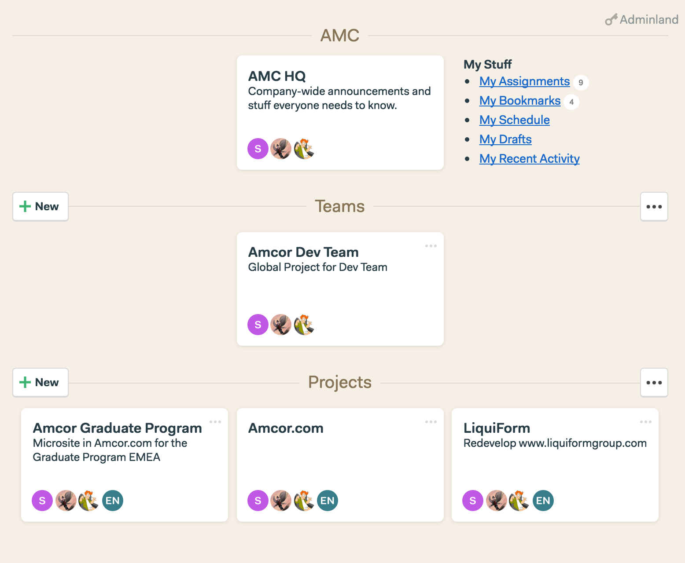
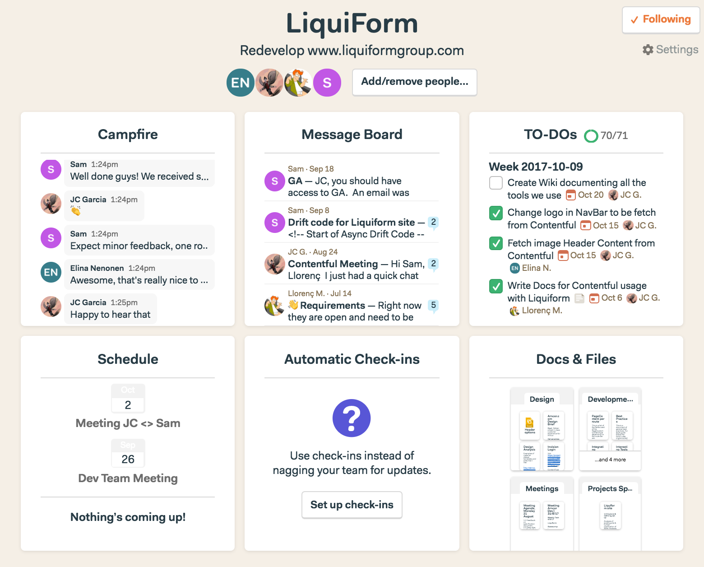

## Basecamp

We use [Basecamp](https://basecamp.com) as Project Management & Team Communication Software.

To be granted access to the Project or Team, please contact the Project Owner. You can find the directory [here](./Support).

This is a intern guide for the usage of Amcor projects, if you need info about basic usage of the app, please refer to the offcial documentation: [Basecamp - How it works](https://basecamp.com/how-it-works)

### Sections
Our Basecamp is divided in 3 sections:

- **HQ**: Where the company has its base, and all the people can have communication, not specifically related the a project or team.
- **Teams**: In case we have different teams working for the company, all the data managed by that team will be shared in this section.
- **Projects**: Every specific project has a section, to share the data and where only the users related to that project will have access.

The 3 sections have common tools and will be accordingly.

### Tools

- **Campfire**: Common chat for all users of the project.

- **Message Board**: Discussions about an specific topic.

- **TODOs**: List of TODOs, that should be assigned to the users. The TODOs are listed in sprints by weeks, and each TODO must contain:
  - Title: Brief explanation of the TODO
  - Assign to: User in charge of this TODO
  - Due Date: Specific deadline for the TODO
  - Notes: In case are required.
- **Schedule**: Calendar for any event related to the project

- **Automatic Check-ins**: every user is accountable for its work, and its a good practise to fill the check-ins daily

- **Docs & Files**: All the documentation related to the project should be listed here in its respective folders. All the documentation is organic and should be managed carefully and keep it sorted. At the moment we have different folders for specific docs:
  - Design: Docs related to UX Design
  - Development: Docs related to Development
  - Meetings: Reports of meetings
  - Project Specs & Docs: General info related to the project
