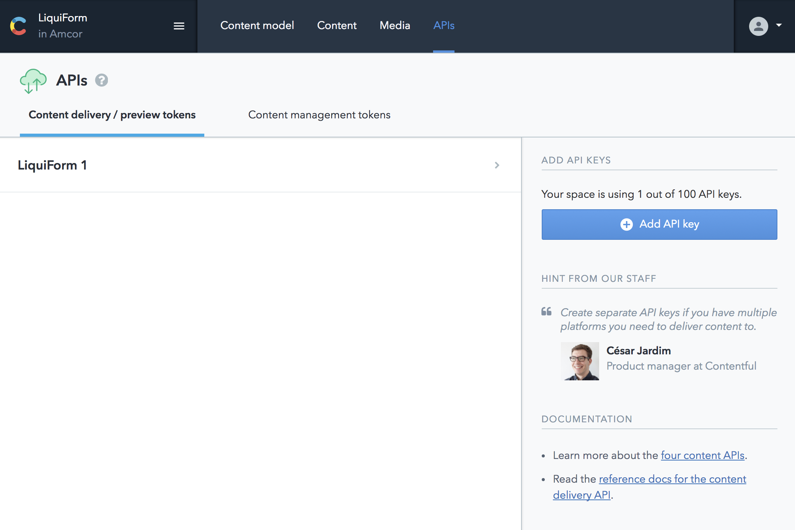
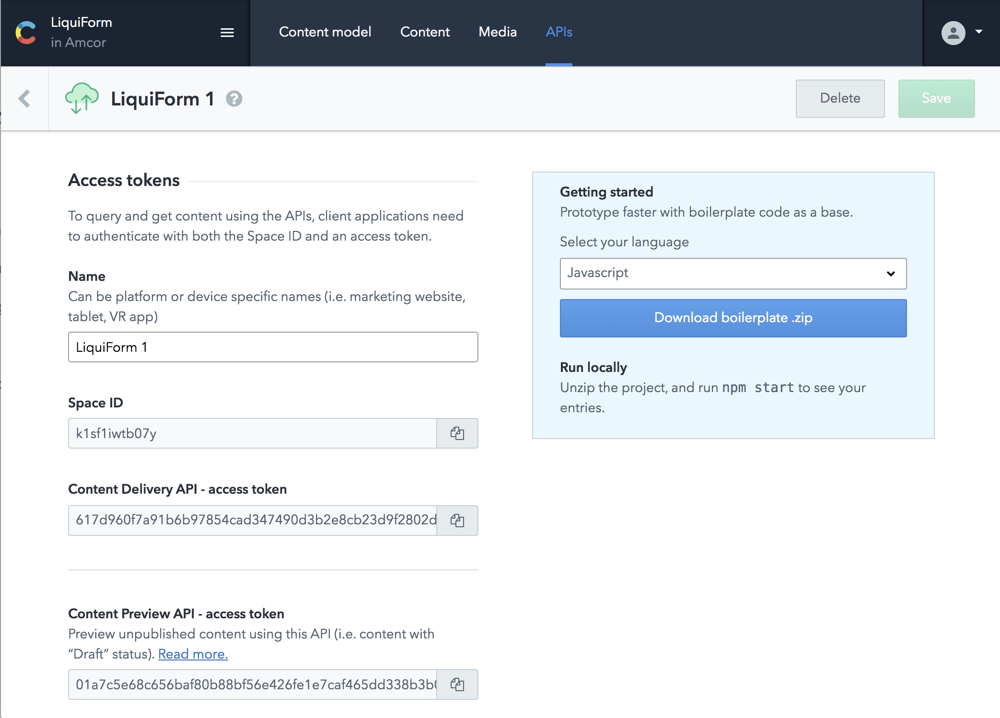

## APIs
- In the APIs section you'll have access to the Access Tokens used to deliver the content through the Content Delivery API, and the Preview API:

### Content Delivery API
The Content Delivery API (CDA), available at cdn.contentful.com, is a read-only API for delivering content from Contentful to apps, websites and other media. Content is delivered as JSON data, and images, videos and other media as files.
The API is available via a globally distributed content delivery network. The server closest to the user serves all content, both JSON and binary. This minimizes latency, which especially benefits mobile apps. Hosting content in multiple global data centers also greatly improves the availability of content.
For more details read the reference guide for the Content Delivery API.

### Content Preview API
The Content Preview API, available at preview.contentful.com, is a variant of the CDA for previewing your content before delivering it to your customers. You use the Content Preview API in combination with a "preview" deployment of your website (or a "preview" build of your mobile app) that allows content managers and authors to view their work in-context, as if it were published, using a "preview" access token as though it were delivered by the CDA.
For more details read the reference documentation for the Content Preview API.

____

### Content Management API
Contentful's Content Management API (CMA) helps you manage content in your spaces.
Note: You can use the CMA to deliver and manage content, but you shouldn't use it to deliver large amounts of content and instead use the Content Delivery API. The structure of responses from the CMA differs from the CDA as GET responses retrieve the entirety of items (i.e. all localized and unpublished content).

You'll need to generate your own personal tokens in order to use the CMA, for example if you want to develop an extension like the HTML editor we use.
Contentful provide the info [here](https://www.contentful.com/r/knowledgebase/ui-extensions-guide/)

You can find the rest of the documentation related to the API [here](https://www.contentful.com/developers/docs/references/content-management-api/)
