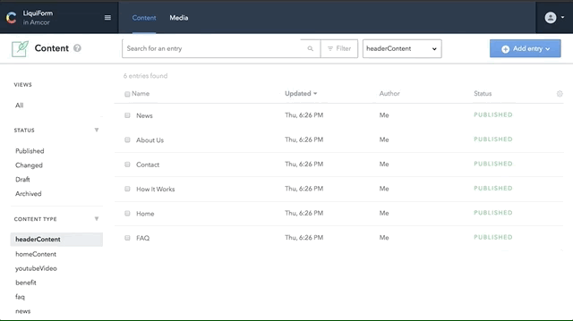

While in **Content** Click on the _"Add Entry"_ button and choose the **ContentType** where you want to add the **Entry**, then you edit the new Entry.

- Adding Entry:

Warning: if you leave a new **Entry** empty, and go back to **Content** that **Entry** will still be created. Remember to [delete](./deleteEntry) it if it's not in use.
