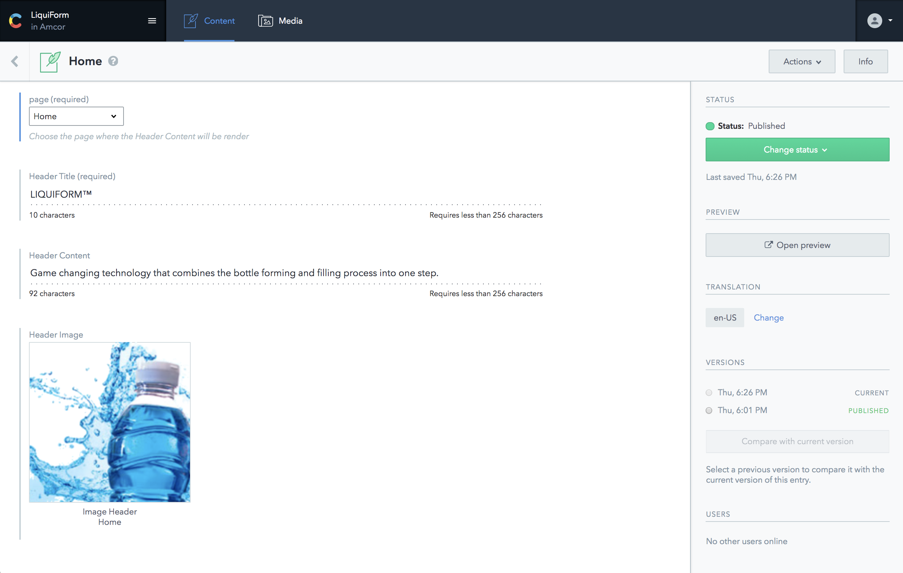
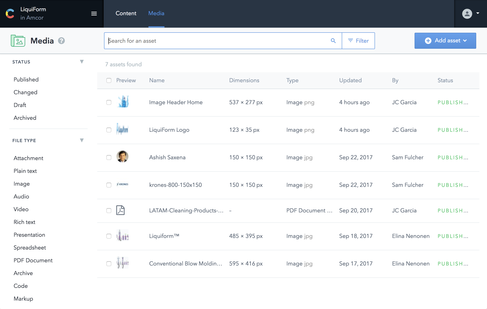

## Content

Each **ContentType** has **Content**, organized by **Entries**. 

For example, the Content Type `headerContent` has this list of entries:

This **Entries** contains the data introduced by the _Editors_ to be rendered in our app.
Each **Entry** contains one or more **fields**, depending on its configuration.

In the example the example the **Entry** belongs to the **ContentType "headerContent"**, containing 4 **fields**:
 - page: dropdown menu to choose what page it will be rendered
 - headerTitle: Text field, that will be the Title of the header
 - headerContent: Text field, that will be the Content below the Title
 - headerImage: Asset previously upload, in this case an image.

 
_____

## Media
In this section are stored the **Assets** that later can be used in an specific field.
The **assets** are files uploaded by the editors, such as images (jpgs, pngs, gifs...), documents (pdfs, spreadsheets..), etc and can be used in **fields** that require a **Reference** or an **Asset**

Media View:
