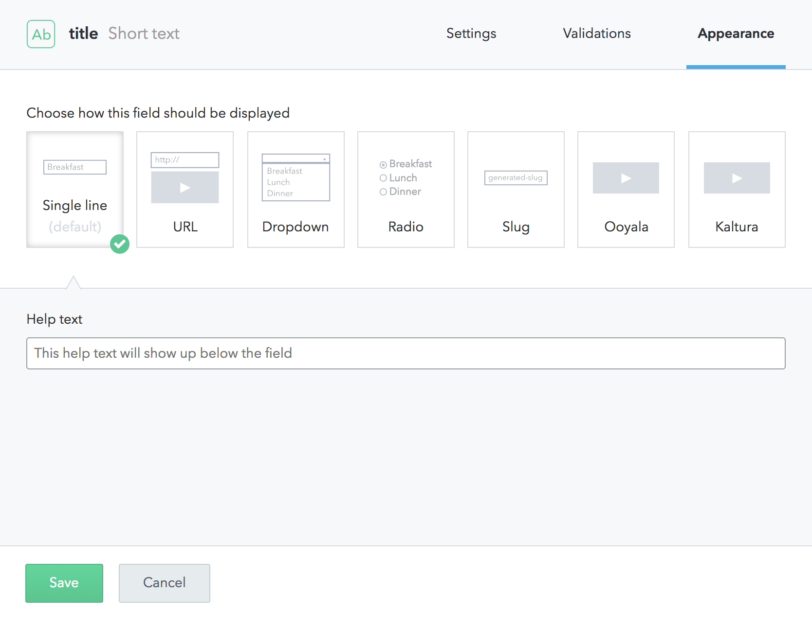

### How to add and setup a ContentType

If we want to create a new ContentType, we click in _Add content type_

Then we define the ContentType:

The next step is to define what type of information to store for each book in our bookstore. This is done by adding fields.

Contentful currently support a number of formats:

Then we configure the Settings,Validations, and Appearance that we desire. In this example we are using the `news` ContentType

And finally, this is the aspect of our ContentType that the [Editors](./CMS-Editors) will use to fill the data.

