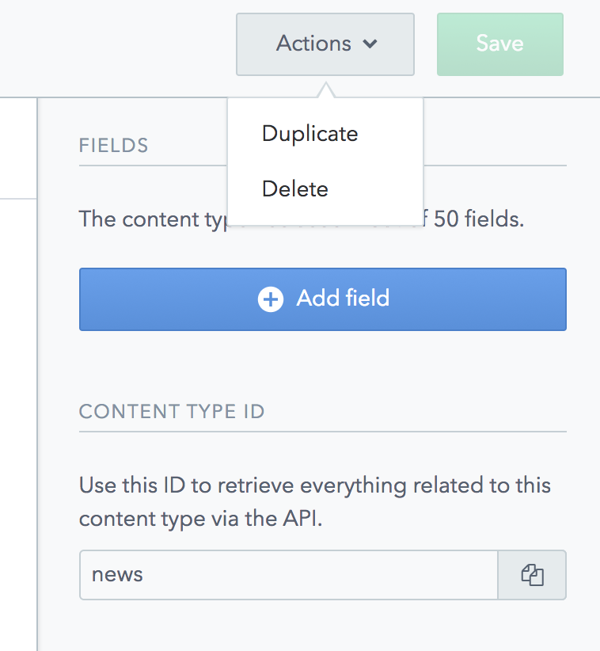
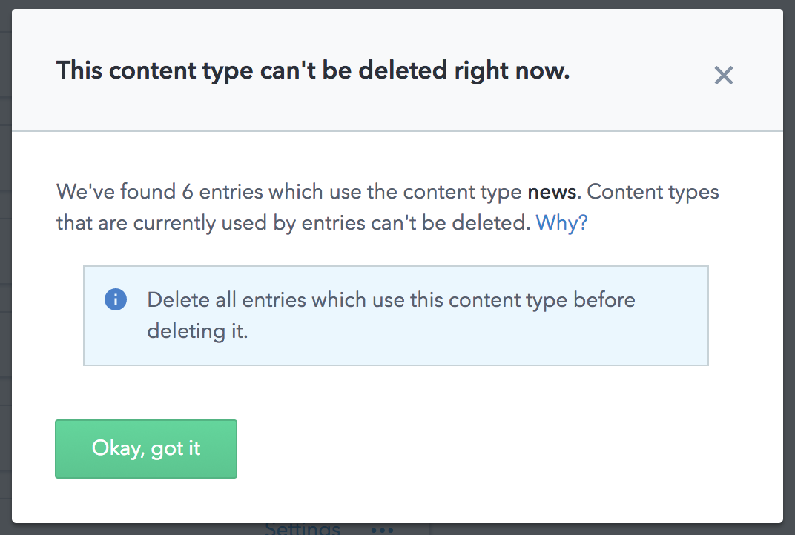

### How to delete a ContentType

In order to eliminate completely a **ContentType**, access the **ContentType** and click in **Actions > Delete**

_Warning_: A **ContentType** can only be deleted if there are no **Entries** using this **ContentType**, otherwise you will have to [delete](./CMS-Delete-Entry) those **Entries** first.

