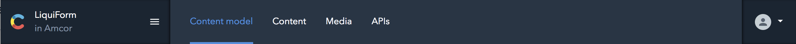
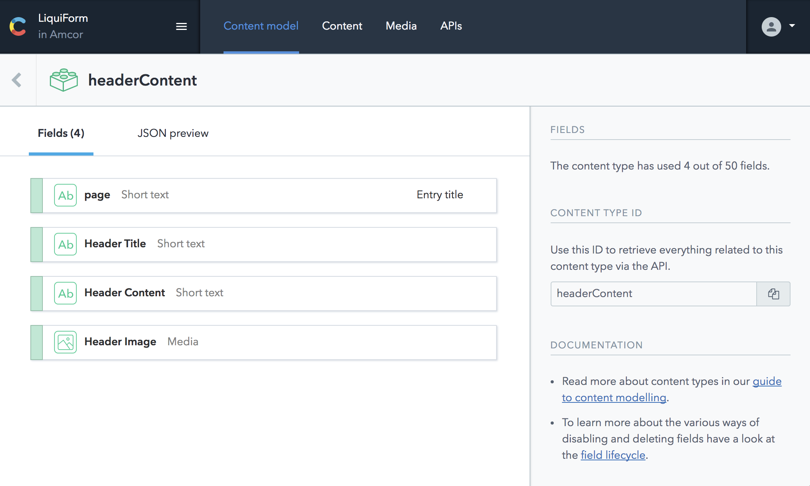
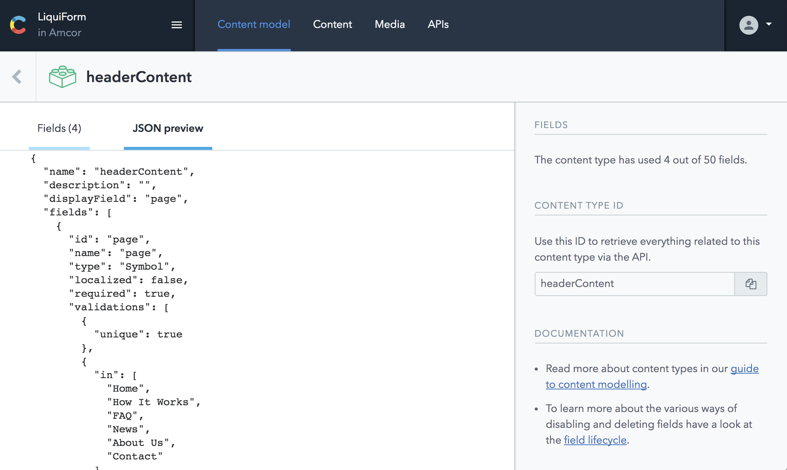
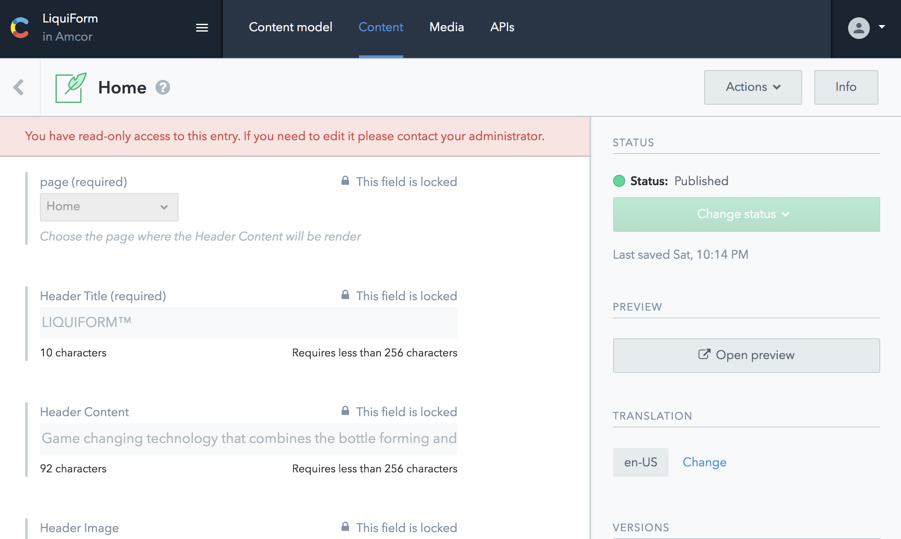

## Developer Role:
- Allows reading Entries and managing API Keys

____

As developer, you have **ONLY READ ACCESS** the [Content Model](./CMS-Structure), and have a JSON Preview of the ContentTypes, in case you want to modify it, you'd have to ask permissions for it.

____

Also you you have **ONLY READ ACCESS** the Content, in case you want to modify it, you'd have to ask permissions for it.

