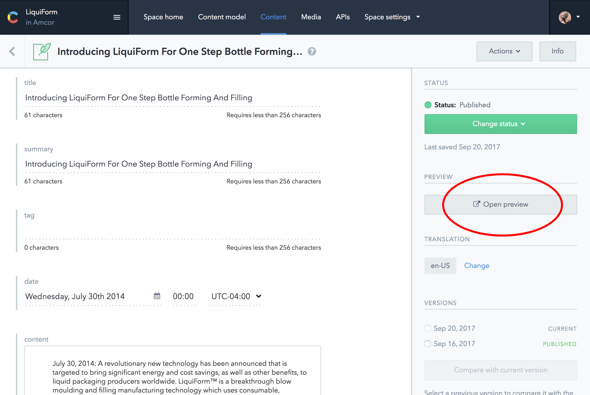

- Preview Mode:

This feature allows you to access the **Preview Mode**. In this mode all the **Entries** are rendered in the browser, including the ones that have _Status_ **UPDATED** or **DRAFT**. 

When you're editing an **Entry**, clicking in _Open Preview_ it will open a new tab in your browser where you can check the changes made from your edition, and preview the whole website. 
