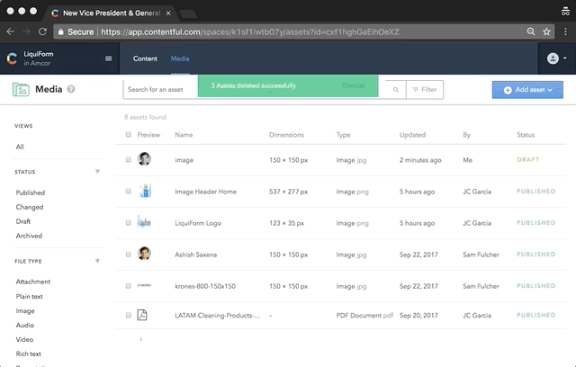
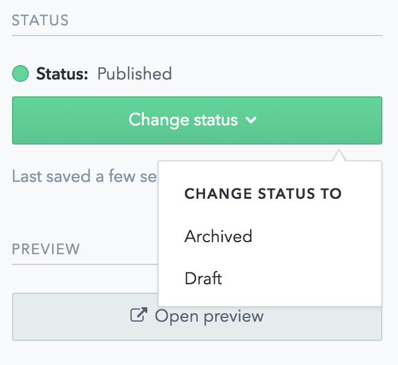

# How to Change STATUS to **PUBLISHED**

There are 2 ways to change the _Status:
- Select a single or multiple contents from the list, and click on the available options:

- When editing an **Entry** or **Asset** click on _"Change status"_ an select the available option:

