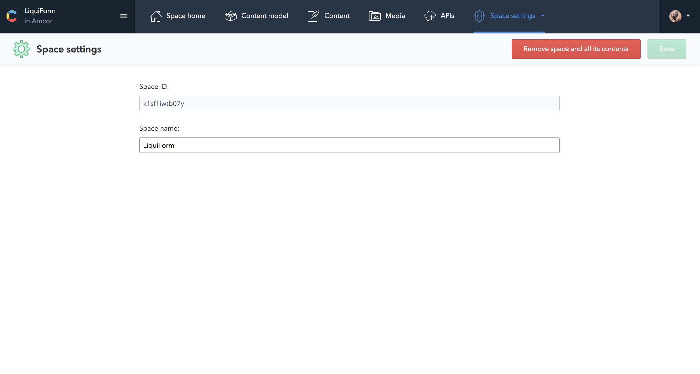
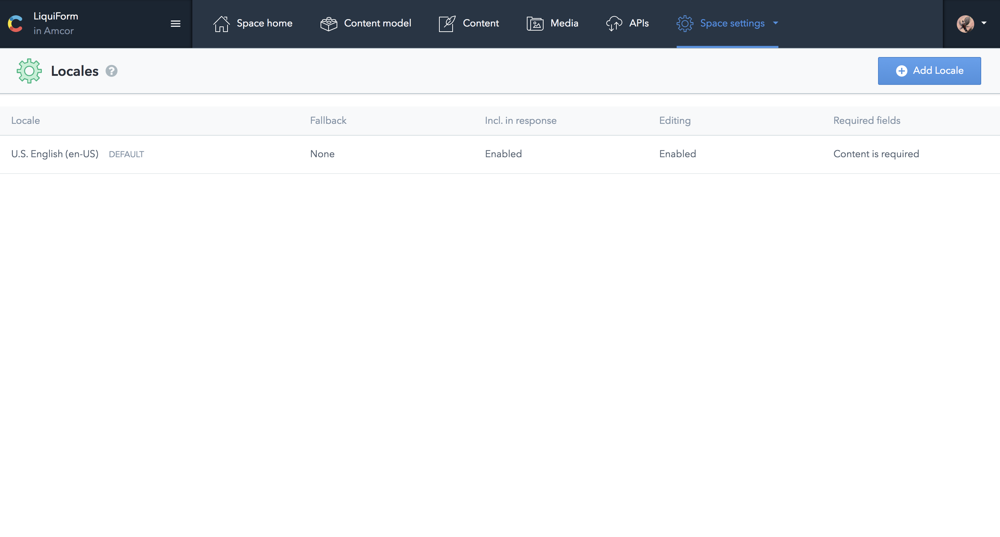
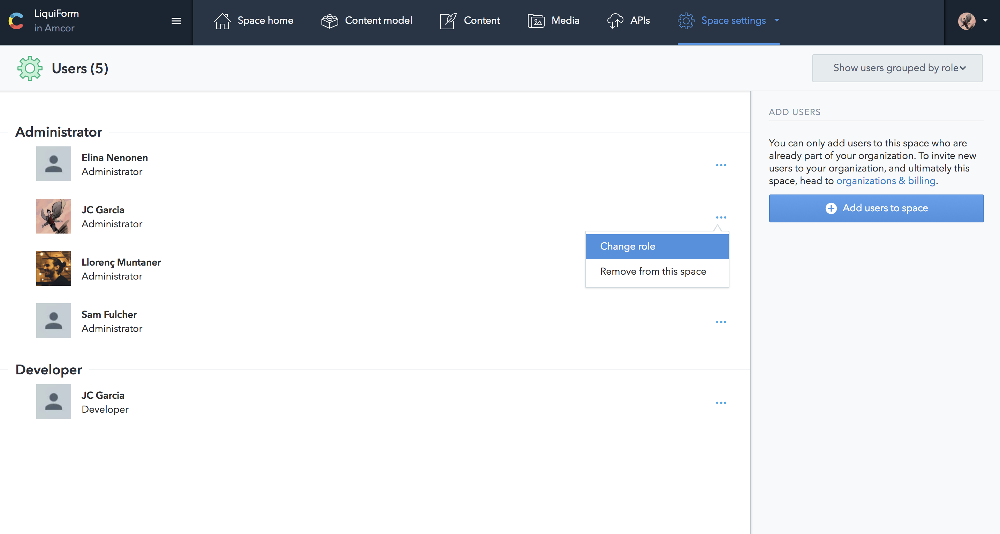
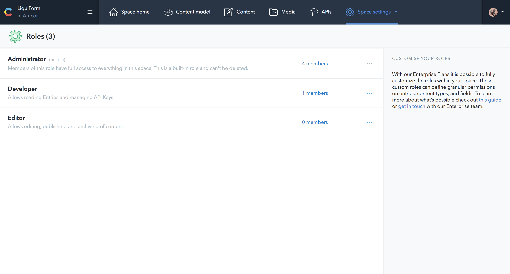
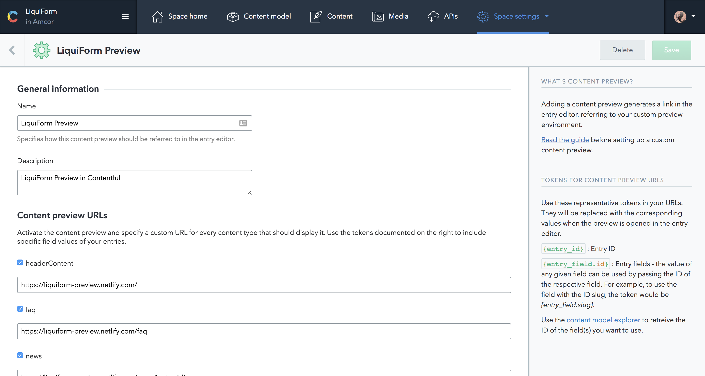

## Space Settings

### General

### Locales

Every Space has its own set of locales, and each locale is uniquely identified by its ISO code (e.g., en-US or de-AT). There's always one default locale defined when you create a space, shown by default in the Contentful web app and used for Content Delivery API queries that do not request a specific locale.

Official docs [here](https://www.contentful.com/developers/docs/concepts/locales/)

### Users

### Roles

Creating a new role:

Select "Roles" from the "Settings" menu at the top of the screen (this menu is only available to space administrators). Find a role in the list that is similar to the role you'd like to create, click "…", and select "Duplicate role". On this new screen you can customize the rules that will apply to users who are assigned this role.

LiquiForm roles [here](./CMS-Roles)
Official docs [here](https://www.contentful.com/r/knowledgebase/roles-and-permissions/)

### Webhooks

Webhooks extend integration possibilities by notifying you, another person or system when resources have changed by calling a pre-configured HTTP endpoint.
<https://www.contentful.com/developers/docs/concepts/webhooks/>

### Content Preview

### Extensions

The UI Extensions SDK allows you to customize and extend the functionality of the Contentful Web App's entry editor. The editor itself is a container for components that enable editors to manipulate the content stored in content fields. Extensions can be simple user interface controls, such as a dropdown, or more complex micro web applications such as our Markdown editor. Extensions are decoupled entities from field types, and you can reuse them, for example using a dropdown to edit number or text fields. Custom extensions that you create are rendered inside a secure iframe.

https://www.contentful.com/developers/docs/concepts/uiextensions/

