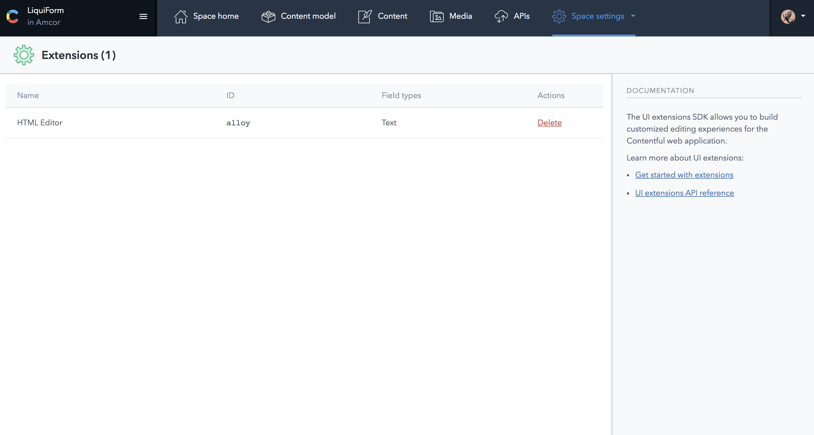

## Space Settings

### General

### Locales

### Users

### Roles

### Webhooks

Webhooks extend integration possibilities by notifying you, another person or system when resources have changed by calling a pre-configured HTTP endpoint.
<https://www.contentful.com/developers/docs/concepts/webhooks/>

### Content Preview

### Extensions

The UI Extensions SDK allows you to customize and extend the functionality of the Contentful Web App's entry editor. The editor itself is a container for components that enable editors to manipulate the content stored in content fields. Extensions can be simple user interface controls, such as a dropdown, or more complex micro web applications such as our Markdown editor. Extensions are decoupled entities from field types, and you can reuse them, for example using a dropdown to edit number or text fields. Custom extensions that you create are rendered inside a secure iframe.

https://www.contentful.com/developers/docs/concepts/uiextensions/

