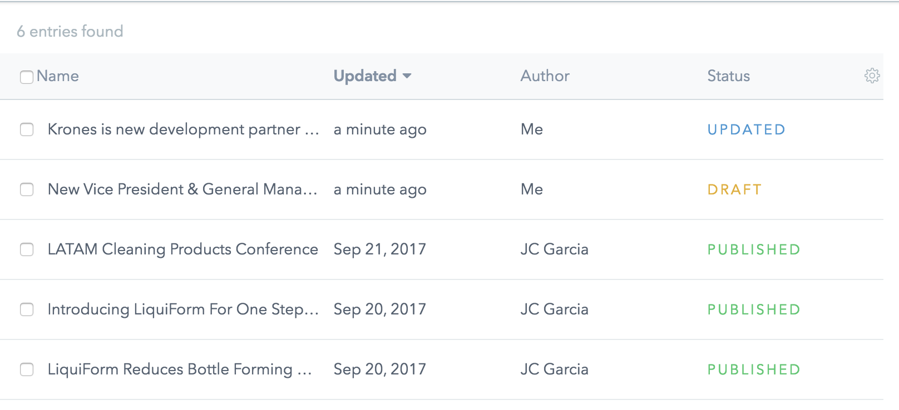
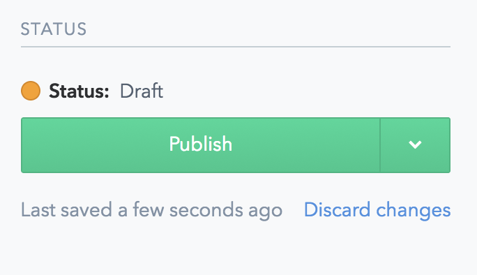
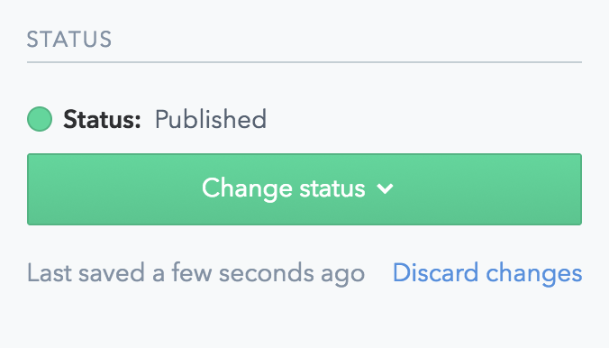
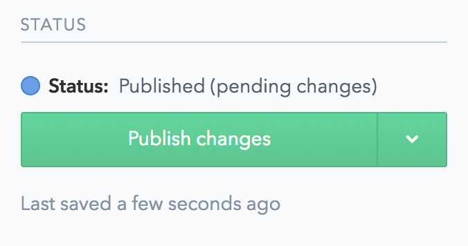
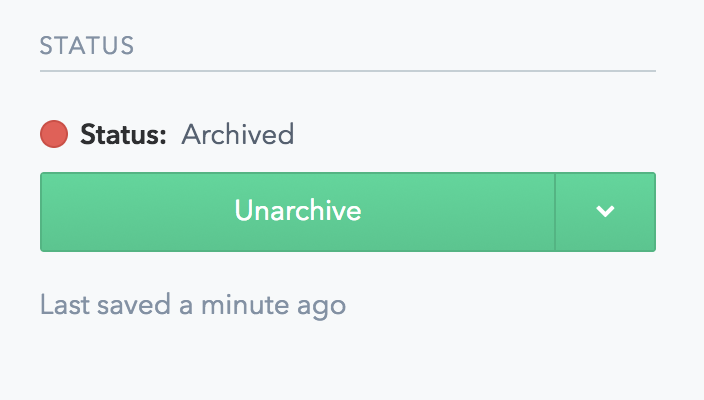
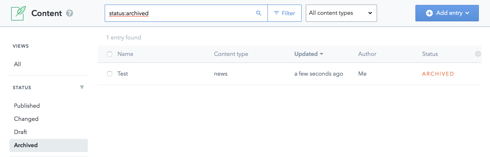

# Type of STATUS

The _Status_ of an **Entry** or **Asset** indicates whether that content is been **DRAFT**, **PUBLISHED**, **UPDATED**, or **ARCHIVED** 

Examples of diferent _Status_:

____

- ## DRAFT: 
The content has been created, but not yet published, and is not visible publicly, only in [_PREVIEW MODE_](./CMS-Preview)

____

- ## PUBLISHED:
The content has been published, and now is visible publicly in the [website](http://www.liquiformgroup.com).

____

- ## UPDATED:
The content has been modified, since its creation, but the changes haven't been published. 

____

- ## ARCHIVED:
The content has been archived, and it's NOT VISIBLE anywhere, only when we filter the list of content by _"Archived"_. 

