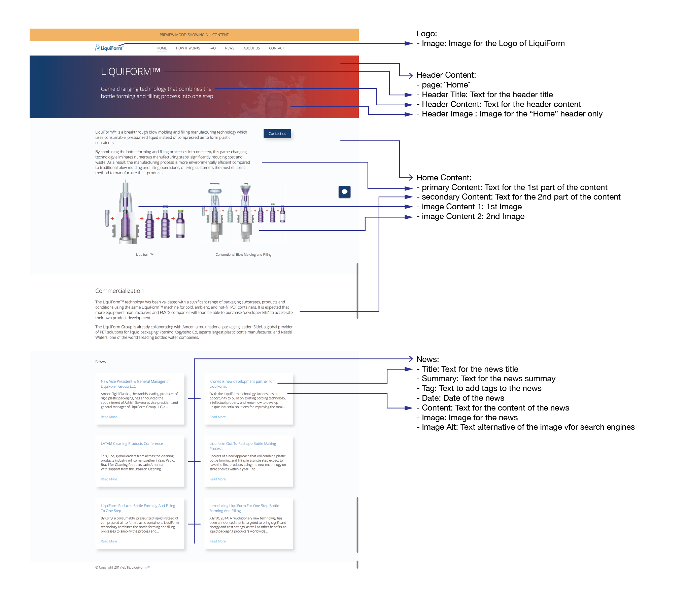
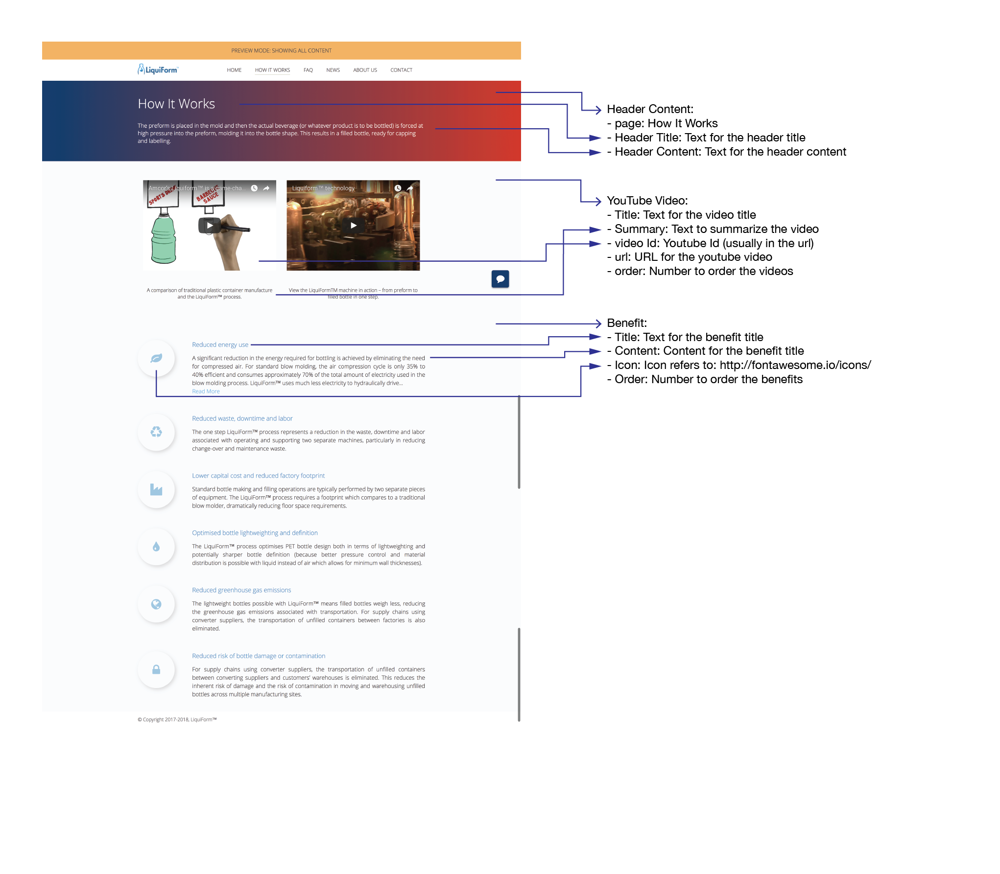
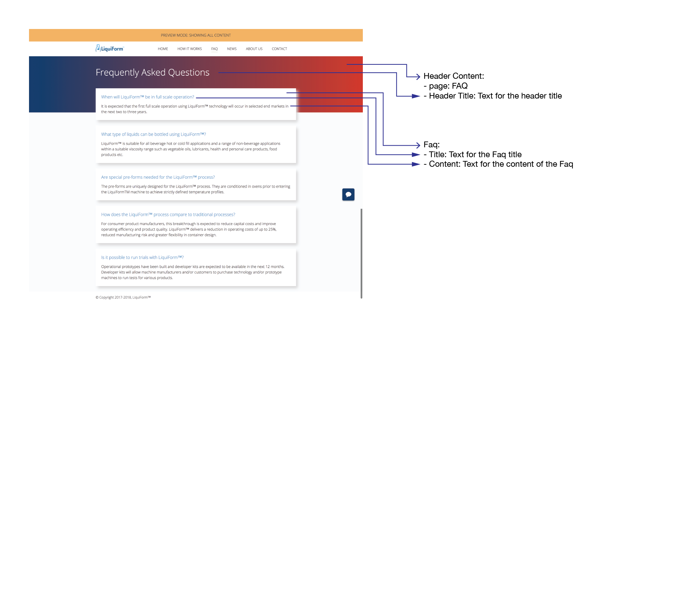
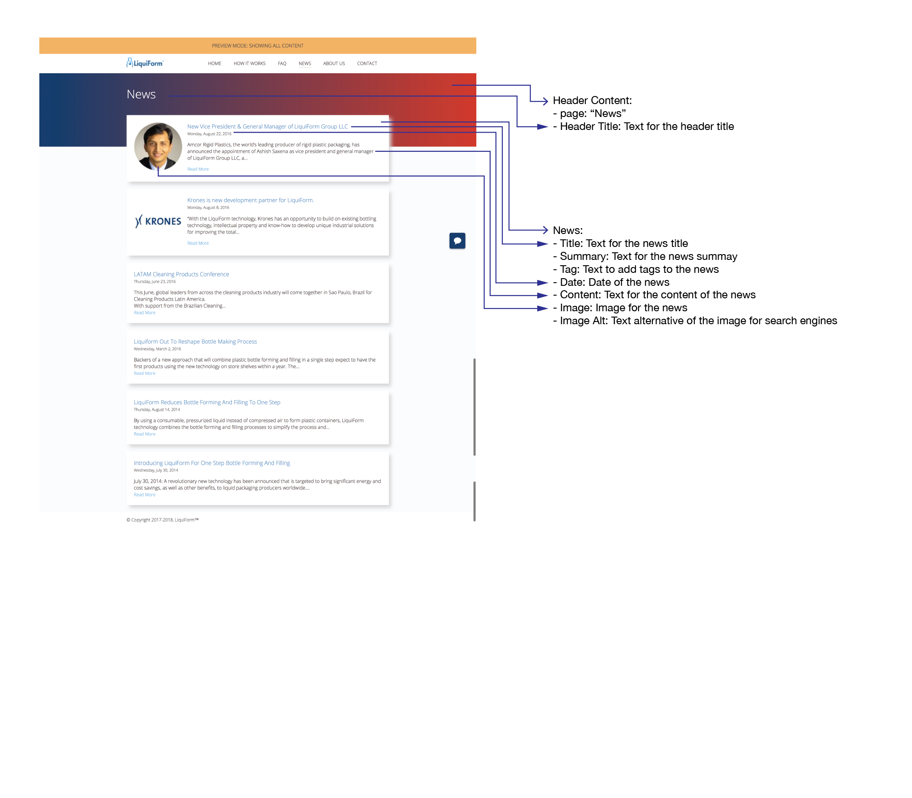
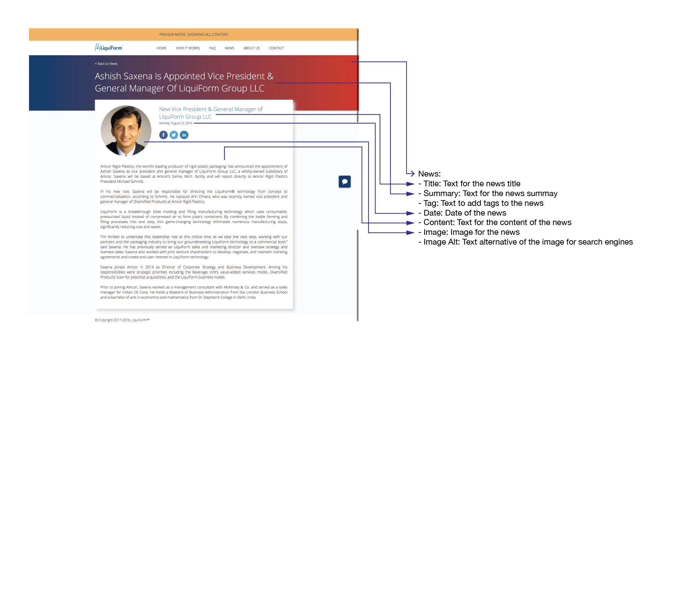
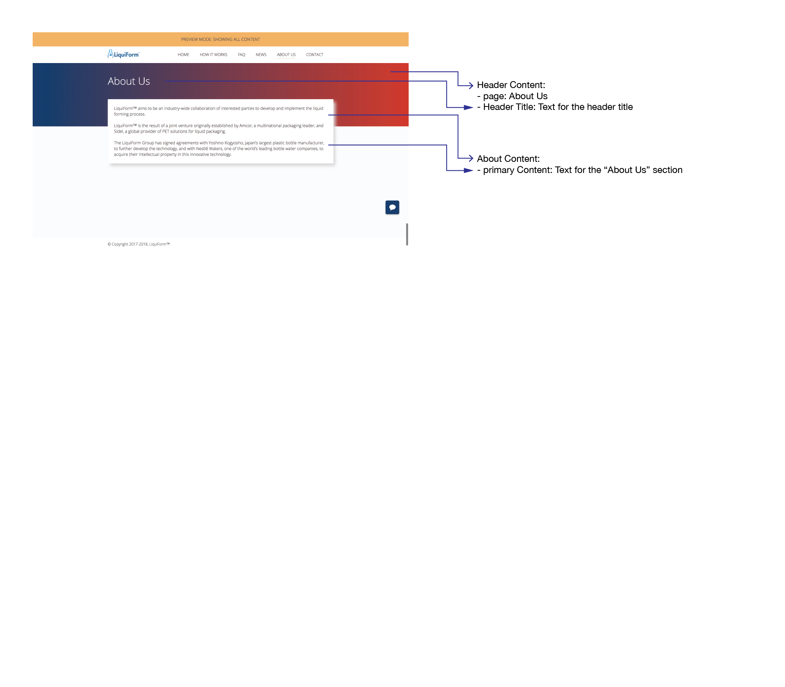
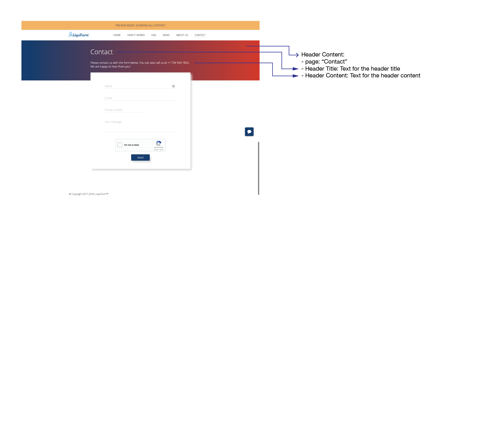

## Space:
Contentful organizes content into spaces, that allows you to group all the related resources for a project together, this includes content entries, media assets, and settings for localizing content into different languages.

Our space name is: `LiquiForm` inside `Amcor` organization.

Each space has a content model that represents the content types you create.
____

## Content Types:
A content type consists of a set of fields and other information.

Structure of LiquiForm Content Types:

### Home

### How it Works

### FAQ

### News

### News Item

### About Us

### Contact

_____

### Schema

- logo:
  - image:
- headerContent:
  - page
  - headerTitle
  - headerContent
  - headerImage
- homeContent:
  - primaryContent
  - secondaryContent
  - imageContent
  - imageContent2
- youtubeVideo:
  - title
  - summary
  - videoId
  - url
  - order
- benefit:
  - title
  - content
  - icon
  - order
- faq:
  - title
  - content
- news:
  - title
  - summary
  - tag
  - date
  - content
  - image
  - imageAlt
- aboutContent:
  - page
  - primaryContent
