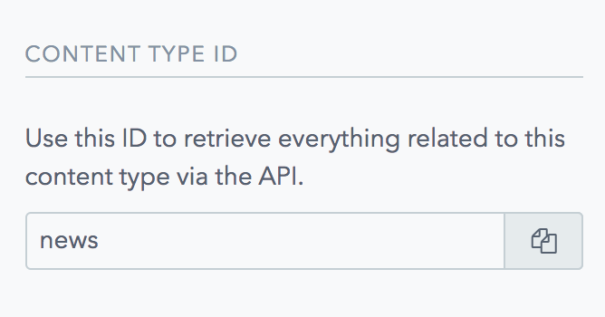

The ContentType name can be updated, with the exception of the ContentType Id, once a contentType is created the Id will remain the same:

 

This Id identifies the ContentType in our API call to retrieve the data stored in the Fields.

Also the Fields can be modified, changing the settings, validations or appearance, but the type of Field will remain the same.

To know how to create a ContentType and configure it check this [page](./ContentType)