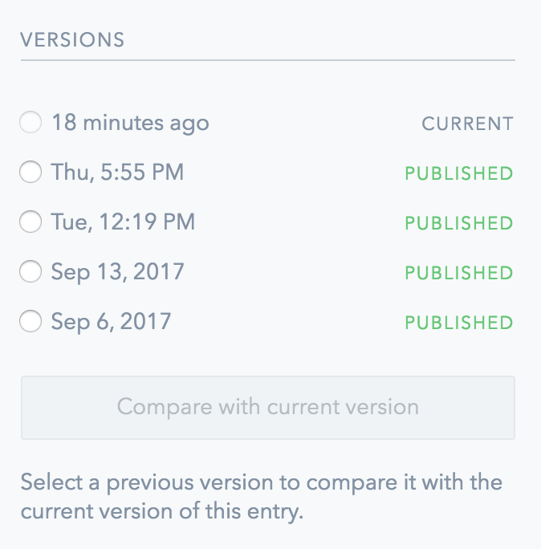

## Versioning

Versioning refers to the practice of producing multiple snapshots of a document. Entry versioning allows Contentful users to view previously published versions of the entry, find out who published an entry and when, compare previous snapshots to the current version, and - when necessary -restore the content to the earlier state.

