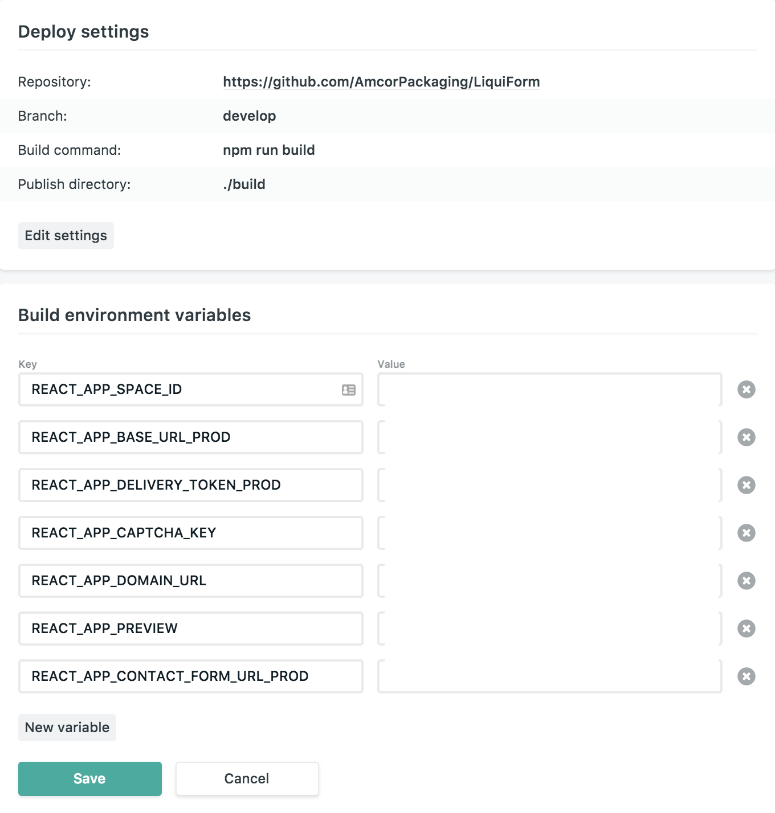

## Netlify

[Netlify](https://www.netlify.com/) is web service to build, deploy, and host our front end.

This wiki will explain the process of deploying the [LiquiForm app](https://github.com/AmcorPackaging/LiquiForm), and the integration with [Contentful](./Contentful-CMS).
For more detailed info, please follow the official [Netlify Docs](https://www.netlify.com/docs/)

To be granted access to the Netlify sites, please contact the Project Owner.
You can find the directory [here](./Support).

### Deployment sites

We use 2 different sites, that shares the same Codebase. This allows the editors to have a full updated site while checking the content that is being updated in Contentful.

[LiquiForm Production Site](https://app.netlify.com/sites/liquiform-dev-2017):
  - This is the link to the app that is render publicly. Only the content published is shown here.
[LiquiForm Preview Site](https://app.netlify.com/sites/liquiform-preview-2017)
  - This is the link to the app that renders all the content stored in Contentful, including the unpublished content.

____

### Setting up Codebase

As our data is stored in [Contentful](./Contentful-CMS) we will need access its [API](./CMS-API).
We will create the file `.env` in the root of our directory with this content:
```
REACT_APP_SPACE_ID="k1sf1iwtb07y"

REACT_APP_BASE_URL_PROD=https://cdn.contentful.com
REACT_APP_DELIVERY_TOKEN_PROD="delivary token"
REACT_APP_CONTACT_FORM_URL_PROD=https://formspree.io/"mail to send the contact form in production mode"

REACT_APP_BASE_URL_DEV=https://preview.contentful.com
REACT_APP_DELIVERY_TOKEN_DEV="preview token"
REACT_APP_CONTACT_FORM_URL_DEV=https://formspree.io/"mail to send the contact form in preview mode"

REACT_APP_CAPTCHA_KEY="captcha key"
REACT_APP_DOMAIN_URL=www.liquiformgroup.com
REACT_APP_PREVIEW=true
```

### Setting up Netlify

In order to integrate Netlify with Github, you'll need admin access to the repository. Netlify will create a webhook, to check updates on the code and deploy the version automatically.

1. [Create a new site](https://app.netlify.com/start): Select `Github` as Continuous Deployment.


____

2. Pick the repository where the app is located.
____
3. Setup the deployment:

  - Branch to deploy: This will be the branch to deploy. Usually `master`
  - Build command: As we are using React, the script require is `npm run build`
  - Publish directory: `./build`
  - Advanced build settings -> Here we will have our Environment Variables and they will be different for the `production` and the `preview` sites:
_____
    - `production`: same as in the .env file


____

    - `preview`:
  - The keys have to be set as `..._PROD` in order to be deployed correctly.
  - Create the key `REACT_APP_PREVIEW` and set the value `TRUE`. This will allow our Codebase to trigger the preview site when needed.



### Continuous Integration with Github

When a `PR` is created, if the setup is done correctly Netlify will create a check on the `PR` and access to a **Deployment Preview** link.

Warning: Don't merge any `PR` if some check is failing.


